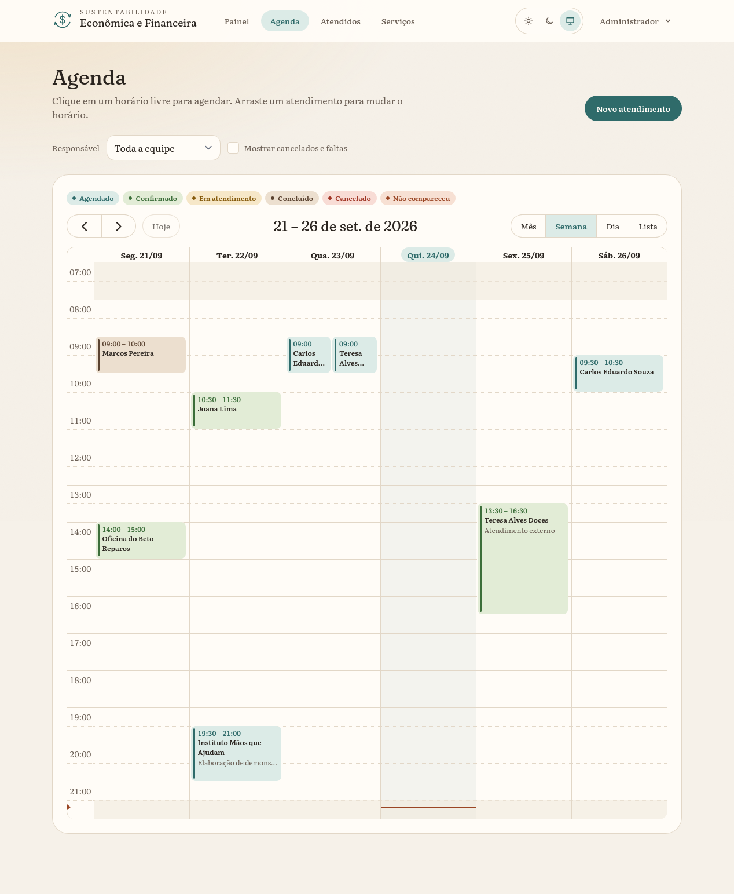
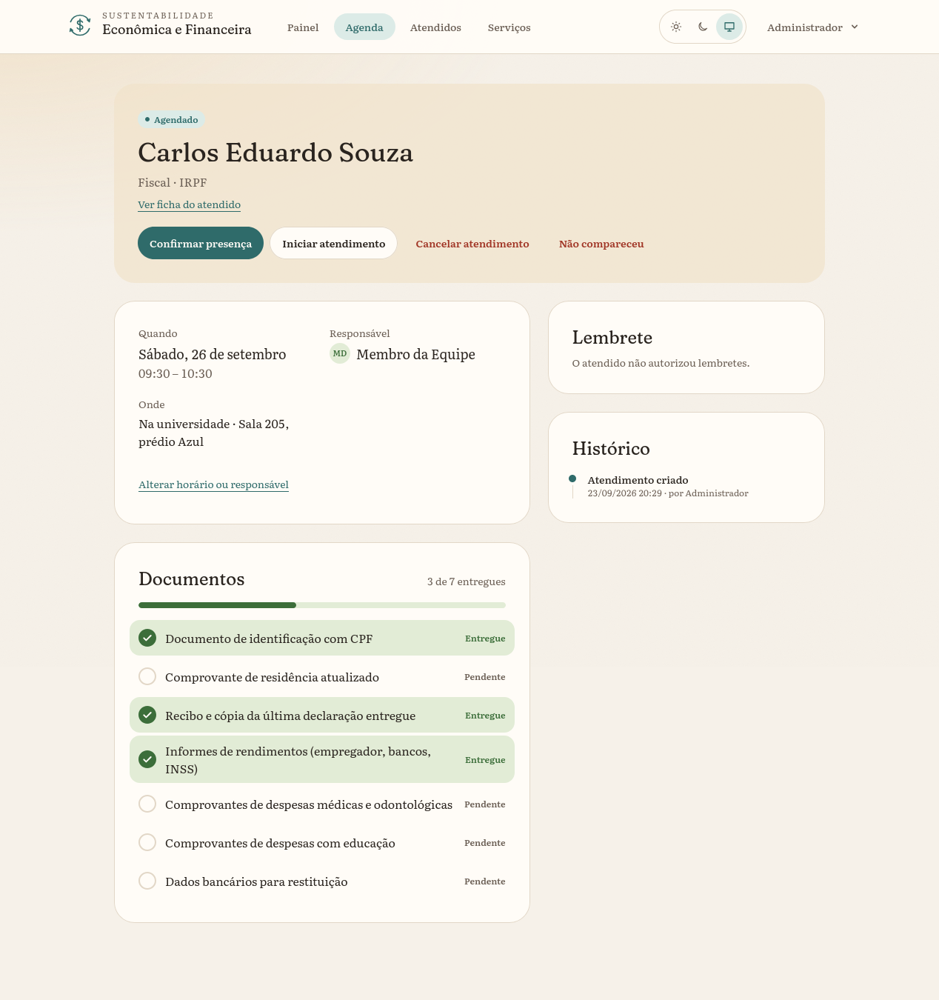
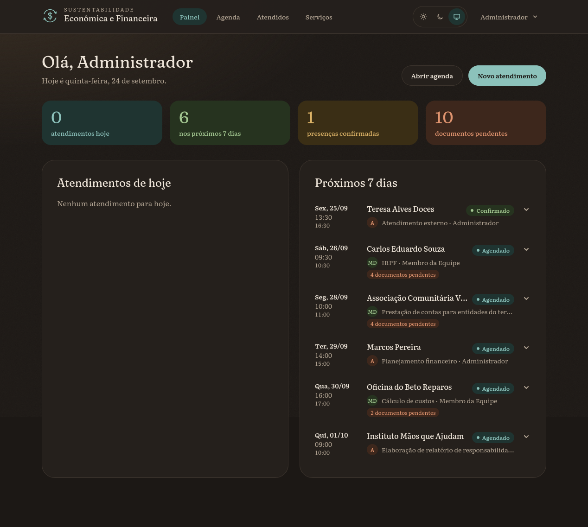

# Agenda Contábil

Sistema web para agendar e acompanhar os atendimentos do projeto de extensão
Sustentabilidade Econômica e Financeira, do curso de Ciências Contábeis da
Feevale. O projeto, coordenado pela Profa. Maristela Mercedes Bauer, orienta
pessoas físicas, MEIs, pequenas empresas e entidades sem fins lucrativos do Vale
do Rio dos Sinos em imposto de renda, guias de tributos, fluxo de caixa,
orçamento e prestação de contas.

Há uma [prévia no GitHub Pages](https://unusualhatter.github.io/Agenda-Contabil/)
com dados fictícios. O login já vem preenchido e nada do que você mudar lá é
salvo.



## Para que serve

Os atendimentos acontecem na universidade, em espaços de parceiros, como a Sala
do Empreendedor de Campo Bom, e on-line. A agenda reúne tudo num lugar só: quem
será atendido, por quem, quando, sobre o quê e com quais documentos.

A equipe pode:

- cadastrar atendidos, pessoas físicas ou jurídicas, e consultar o histórico de
  cada um;
- agendar um atendimento escolhendo atendido, demanda, horário e responsável. O
  sistema recusa o horário se a mesma pessoa já tiver outro atendimento nele;
- ver a agenda por mês, semana, três dias, dia ou lista, clicar num horário livre
  para agendar e arrastar um atendimento para trocar o horário;
- acompanhar cada atendimento do agendamento à conclusão, com histórico de quem
  mudou o quê.

Cada demanda tem uma lista de documentos a levar (o informe de rendimentos no
IRPF, o CCMEI no atendimento de MEI, o estatuto na prestação de contas de uma
ONG). A lista vai junto com o agendamento e a equipe marca o que já chegou.
Administradores editam os serviços e as listas em `/configuracoes/servicos`.



Se o atendido autorizou, o sistema manda um e-mail 24 horas antes com data, local
e documentos, e um link para confirmar ou cancelar sem criar conta. A mesma
mensagem pode ser enviada pelo WhatsApp com um clique. Um cancelamento pelo link
libera o horário e fica registrado no histórico.

Existem três perfis: administrador, membro da equipe e visualizador. O
visualizador só consulta.



## Como foi feito

A base é o que a comunidade Laravel chama de TALL: Tailwind, Alpine, Laravel e
Livewire.

| Peça | O que faz aqui |
| --- | --- |
| Laravel 13 e PHP 8.3 | Rotas, regras de negócio, autorização, fila de e-mails |
| Livewire 4 e Alpine.js | Formulários, busca e telas que respondem sem recarregar |
| Blade e Tailwind CSS 4 | Telas e estilos, com tema claro e escuro |
| FullCalendar 6 | A agenda |
| PostgreSQL 18 | Todos os dados. Ele também impede horários sobrepostos, guarda o histórico sem permitir edição e registra quem alterou dados pessoais |
| GitHub e GitHub Actions | Código, testes a cada push e a prévia publicada |

As fontes Fraunces e Literata vêm empacotadas no build, sem chamada a serviço
externo. A rolagem suave usa a biblioteca Lenis, e a troca entre páginas usa o
`wire:navigate` do Livewire, que evita recarregar tudo.

A interface é toda em português e o código em inglês. Os horários ficam no
banco em UTC e aparecem no fuso de São Paulo.

## Equipe

Beatriz é a Product Owner e responde pela interface e pela experiência de uso.
Conversa com o cliente para levantar o que o projeto precisa, confere com o grupo
o que dá para fazer e desenha as telas. O restante do grupo desenvolve o
back-end e o front-end e cuida do banco de dados.

## Rodando na sua máquina

Você precisa de PHP 8.3 ou mais novo (com as extensões `pdo_pgsql`, `mbstring`,
`intl`, `bcmath`, `gd` e `zip`), Composer 2, Node 22 (o Vite 8 aceita a partir do
20.19) e PostgreSQL. Usamos o 18; as versões anteriores não foram testadas.

Crie o usuário e os bancos:

```sh
sudo -u postgres psql -c "CREATE ROLE agenda LOGIN PASSWORD 'agenda' CREATEDB;"
sudo -u postgres createdb -O agenda agenda_contabil
sudo -u postgres createdb -O agenda agenda_contabil_test
```

O segundo banco é o dos testes, que rodam em PostgreSQL de verdade porque parte
das regras (horários sobrepostos, histórico protegido) vive no banco.

Depois, na pasta do projeto:

```sh
composer install
npm install
cp .env.example .env
php artisan key:generate
php artisan migrate --seed
npm run build
composer dev
```

O `composer dev` sobe o servidor em `http://localhost:8000`, a fila de e-mails,
o log e o Vite. Se o seu PostgreSQL usar outra senha, ajuste as variáveis `DB_*`
do `.env`.

O `--seed` cria os serviços com as listas de documentos, três contas de teste e
duas semanas de atendimentos fictícios em torno da data de hoje. Os e-mails
vão para `storage/logs/laravel.log`.

| E-mail | Senha | Perfil |
| --- | --- | --- |
| `admin@agenda.local` | `password` | Administrador |
| `equipe@agenda.local` | `password` | Membro da equipe |
| `visualizador@agenda.local` | `password` | Visualizador |

## Testes

```sh
php artisan test
vendor/bin/pint --test
npm run build
```

São 176 testes de comportamento: conflito de horários, permissões por perfil,
lembretes, validações, regras do banco. O Pint confere a formatação. A CI
(`.github/workflows/ci.yml`) roda os três comandos a cada push e pull request,
com um PostgreSQL próprio.

## Dados pessoais

O sistema guarda nome, contato, CPF/CNPJ e anotações sobre a situação financeira
de quem é atendido, então a proteção desses dados pesou nas decisões:

- CPF/CNPJ e anotações ficam criptografados no banco. O CPF/CNPJ ainda pode ser
  buscado pelo número completo, por um índice que não revela o valor;
- o CPF/CNPJ é conferido pelos dígitos verificadores e não se repete entre
  atendidos;
- lembretes só saem para quem autorizou, e a data da autorização fica gravada;
- a sessão expira em 60 minutos e termina ao fechar o navegador. Uma conta
  desativada perde o acesso no clique seguinte;
- em produção a aplicação conecta ao banco com um usuário que não apaga
  atendimentos nem mexe no histórico (veja "Colocando no ar"), e cada alteração
  em atendidos e usuários vai para uma trilha de auditoria.

## Colocando no ar

No `.env` do servidor, use `APP_ENV=production`, `APP_DEBUG=false`, `APP_URL`
com o endereço público e `SESSION_SECURE_COOKIE=true`, e sirva o sistema só por
HTTPS. Em produção o sistema recusa senhas que aparecem em vazamentos conhecidos
e não roda os seeders de demonstração.

Não há cadastro público. Depois das migrations, crie o primeiro administrador no
terminal (`php artisan tinker`):

```php
App\Models\User::create([
    'name' => 'Nome da pessoa',
    'email' => 'email@exemplo.com',
    'password' => 'uma-senha-longa-e-unica',
    'role' => App\Domain\Users\Enums\UserRole::Admin,
]);
```

Para desligar uma conta, marque `active` como `false`. O histórico continua
apontando para ela.

Usuário do banco. Em produção a aplicação não deve conectar como dono do
PostgreSQL. O script `database/sql/privileges.sql` cria dois papéis: `agenda_app`,
que lê e grava dados mas não altera estrutura, histórico ou auditoria, e
`agenda_reports`, que só enxerga a view `appointment_facts` (sem nome, contato,
documento nem observações). Rode-o depois das migrations, como superusuário:

```sh
psql -d agenda_contabil -v owner=<dono do banco> \
     -v app_password='...' -v reports_password='...' \
     -f database/sql/privileges.sql
```

Depois, o `.env` passa a usar `DB_USERNAME=agenda_app`, e as migrations dos
próximos deploys rodam com o dono: `DB_USERNAME=<dono> php artisan migrate --force`.

Lembretes por e-mail precisam de três coisas no servidor: o agendador do Laravel
no cron, um worker de fila e um servidor SMTP nas variáveis `MAIL_*`.

```
* * * * * cd /caminho/do/projeto && php artisan schedule:run >> /dev/null 2>&1
```

```sh
php artisan queue:work
```

O agendador dispara `appointments:send-reminders` a cada 15 minutos. Os links do
e-mail são assinados com o `APP_URL`, então deixam de valer se o endereço mudar.

## Prévia no GitHub Pages

O GitHub Pages só serve arquivos estáticos e não roda o sistema. Por isso a prévia
é gerada pelo próprio projeto: `php artisan preview:export <endereço>` renderiza
as páginas reais, com os dados de demonstração, e grava HTML em `build/preview/`.
Navegação, agenda, busca de atendidos, tema e animações funcionam. O que gravaria
dados fica bloqueado e um aviso explica. O comando não roda em produção e
também para se encontrar atendidos com e-mail que não seja de exemplo, para
que dado real nunca vá parar numa página pública.

Para publicar, escolha GitHub Actions em *Settings → Pages → Build and
deployment*. Depois disso, cada push na `main` dispara o workflow
`.github/workflows/preview.yml`, que monta o banco de demonstração e publica em
`https://<usuário>.github.io/<repositório>/`.

Para ver a prévia na sua máquina:

```sh
php artisan migrate:fresh --seed
ASSET_URL=http://127.0.0.1:8090 npm run build
php artisan preview:export http://127.0.0.1:8090
python3 -m http.server 8090 -d build/preview
```

## Para onde olhar no código

```
app/Domain/     regras de negócio: agendar, reagendar, status, lembretes, catálogo
app/Livewire/   formulários e telas interativas
app/Http/       controllers, requests, middlewares de segurança
app/Models/     models e relacionamentos
app/Policies/   quem pode fazer o quê
resources/js/   agenda, tema, navegação, animações
database/       migrations, seeders e o script de papéis do PostgreSQL
```

O [`PRD.md`](PRD.md) tem os requisitos, as regras de domínio e os marcos do projeto.

## Fontes consultadas

Estilo de código e regras de domínio:

- [laravel.io](https://github.com/laravelio/laravel.io): classes de ação com um
  único método, classes de consulta e enums com `match`
- [Easy!Appointments](https://github.com/alextselegidis/easyappointments): regra de
  sobreposição de horários
- [Monica CRM](https://laraveldaily.com/code-examples/example/monicahq-monica/notifications):
  lembretes agendados
- [PostgreSQL: restrições em intervalos](https://www.postgresql.org/docs/current/rangetypes.html#RANGETYPES-CONSTRAINT),
  [funções de trigger](https://www.postgresql.org/docs/current/plpgsql-trigger.html)
  e [GRANT](https://www.postgresql.org/docs/current/sql-grant.html)
- [Paragon Initiative: busca em dados criptografados](https://paragonie.com/blog/2017/05/building-searchable-encrypted-databases-with-php-and-sql)

Interface:

- [FullCalendar: `timeZone`](https://fullcalendar.io/docs/timeZone) e
  [`eventContent`](https://fullcalendar.io/docs/event-render-hooks)
- [Akash Hamirwasia: troca de tema com View Transitions](https://akashhamirwasia.com/blog/full-page-theme-toggle-animation-with-view-transitions-api/)
- [WCAG 2.1: contraste mínimo](https://www.w3.org/TR/WCAG21/#contrast-minimum), usado
  para conferir as cores nos dois temas

Documentação oficial de Laravel, Livewire, Tailwind, Vite e Lenis, e a
[LGPD](https://www.planalto.gov.br/ccivil_03/_ato2015-2018/2018/lei/l13709.htm) para
as decisões sobre dados pessoais.
